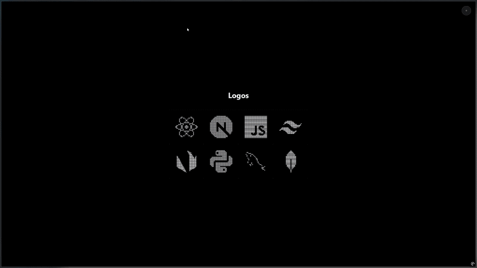

# 🎨 Pixel Art Logos

> Animations interactives de logos en pixel art avec React et Canvas API



## 🚀 Démarrage rapide

```bash
npm install
npm run dev
```

## ✨ Fonctionnalités

- Animation pixel par pixel au hover (desktop)
- Animation au scroll (mobile)
- Mode clair/sombre adaptatif
- Grille responsive (4→2 colonnes)

## 🎯 Ajouter un logo

**1. Convertir l'image en matrice**  
J'ai utilisé [Convertisseur Pixel Art](https://github.com/ELM-CIEL/convertisseur-pixel-art) pour créer les matrices

**2. Ajouter dans `src/assets/matrices.js`**

```javascript
export const MATRICES = {
  monlogo: [
    [0, 1, 1, 0],
    [1, 2, 2, 1],
    [0, 1, 1, 0],
  ],
};
```

**3. Ajouter dans `src/assets/couleurs.js`**

```javascript
export const COULEURS = {
  monlogo: { 0: "transparent", 1: "#FF5733", 2: "#FFC300" },
};
```

## ⚙️ Configuration

| Paramètre         | Valeur | Fichier         |
| ----------------- | ------ | --------------- |
| Pixels/frame      | 4      | `pixelLogo.jsx` |
| Interval          | 10ms   | `pixelLogo.jsx` |
| Fade duration     | 300ms  | `pixelLogo.jsx` |
| Shimmer           | 500ms  | `pixelLogo.jsx` |
| Mobile breakpoint | 768px  | `LogoGrid.jsx`  |

## 🛠️ Technologies

- React 18.3
- Vite 5.0
- Canvas API
- Intersection Observer

## 📄 Licence

MIT

## 🙏 Crédits

- Concept visuel inspiré par le travail de [Bakhtiyor Ganijon](https://github.com/thebkht)
- Matrices créées avec [Convertisseur Pixel Art](https://github.com/ELM-CIEL/convertisseur-pixel-art)
